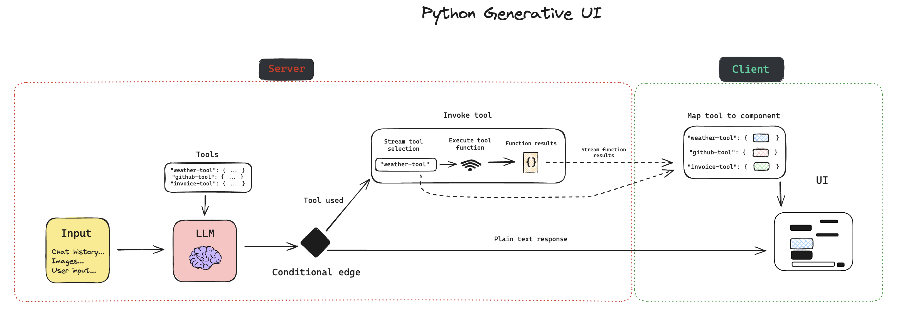

# Generative UI with LangChain Python 🦜🔗



## Overview (Python LangGraph FireCrawl 🔥 Tool)

This application aims to provide a template for building generative UI applications with LangChain Python.
It comes pre-built with a few UI features which you can use to play about with gen ui. The UI components are built using [Shadcn](https://ui.shadcn.com/).

## Getting Started

### Installation

First, clone the repository and install dependencies:

```bash
git clone https://github.com/Gitmaxd/gen-ui-firecrawl-python.git

cd gen-ui-firecrawl-python
```

Install dependencies in the `frontend` and `backend` directories:

```bash
cd ./frontend

yarn install
```

```bash
cd ../backend

poetry install
```

### Secrets

Next, if you plan on using the existing pre-built UI components, you'll need to set a few environment variables:

Copy the [`.env.example`](./backend/.env.example) file to `.env` inside the `backend` directory.

LangSmith keys are optional, but highly recommended if you plan on developing this application further.

The `OPENAI_API_KEY` is required. Get your OpenAI API key from the [OpenAI dashboard](https://platform.openai.com/login?launch).

[Sign up/in to LangSmith](https://smith.langchain.com/) and get your API key.

Create a new [GitHub PAT (Personal Access Token)](https://github.com/settings/tokens/new) with the `repo` scope.

[Create a free Geocode account](https://geocode.xyz/api).

The `FIRECRAWL_API_KEY` is required for web based data extraction (this demo). Get your FireCrawl API key and 500 free credits from the [FireCrawl dashboard](https://www.firecrawl.dev/account).
```bash
# ------------------LangSmith tracing------------------
LANGCHAIN_API_KEY=...
LANGCHAIN_CALLBACKS_BACKGROUND=true
LANGCHAIN_TRACING_V2=true
# -----------------------------------------------------

GITHUB_TOKEN=...
OPENAI_API_KEY=...
GEOCODE_API_KEY=...
FIRECRAWL_API_KEY=...
```

### Running the Application

```bash
cd ./frontend

yarn dev
```

This will start a development server on [`http://localhost:3000`](http://localhost:3000).

Then, in a new terminal window:

```bash
cd ../backend

poetry run start
```

### Go further

If you're interested in ways to take this demo application further, I'd consider the following:

Generating entire React components to be rendered, instead of relying on pre-built components. OR: Using the LLM to build custom components using a UI library like [Shadcn](https://ui.shadcn.com/).
Multi-tool and component usage. Update the LangGraph agent to call multiple tools, and appending multiple different UI components to the client rendered UI.
Generative UI outside of the chatbot window. Have the UI dynamically render in different areas on the screen. E.g a dashboard, where the components are dynamically rendered based on the LLMs output.

## Acknowledgements

I would like to express sincere gratitude to the following contributors for their invaluable educational contributions and the incredible learning opportunity they have created:

- [LangChain](https://twitter.com/LangChainAI) ([@LangChainAI](https://twitter.com/LangChainAI)) - For providing the powerful language processing capabilities that power this application.
- [LangGraph](https://github.com/langchain-ai/langgraph) - For the innovative tool that enables the creation of dynamic and interactive generative UI applications.
- [Developers Digest](https://twitter.com/Dev__Digest) ([@Dev__Digest](https://twitter.com/Dev__Digest)) - For their dedication to fostering a vibrant developer community and sharing valuable insights.
- [Harrison Chase](https://twitter.com/hwchase17) ([@hwchase17](https://twitter.com/hwchase17)) - For his significant contributions to the LangChain ecosystem and his unwavering commitment to advancing the field of language processing.
- [Jacob Lee](https://twitter.com/@Hacubu) ([@Hacubu](https://twitter.com/Hacubu)) - For lighting a fire under my ass to learn Next/JS with all his efforts at LangChain ❤️
- [Lance Martin](https://twitter.com/RLanceMartin) ([@RLanceMartin](https://twitter.com/RLanceMartin)) - For his tireless efforts in evangelizing and educating developers about the potential of generative AI and UI.
- [Brace Sproul](https://twitter.com/BraceSproul) ([@BraceSproul](https://twitter.com/BraceSproul)) - For his invaluable contributions to the developer community and his passion for pushing the boundaries of what's possible with generative technologies.
- [FireCrawl](https://twitter.com/FireCrawl_dev) ([@FireCrawl_dev](https://twitter.com/FireCrawl_dev)) - For providing the powerful web-based data extraction capabilities that enhance the functionality of this application.
- [Vercel AI](https://twitter.com/Vercel) ([@Vercel](https://twitter.com/Vercel)) - For their brilliant work on the GenUI interface, which provides a seamless and intuitive user experience for interacting with generative AI applications.

Their collective expertise, passion, and dedication have made this educational experience possible for me. I are truly grateful for their contributions and the impact they have made on the AI developer community. Their efforts have not only my skills but have also inspired and empowered developers around the word to explore the exciting possibilities of generative AI and user interfaces.